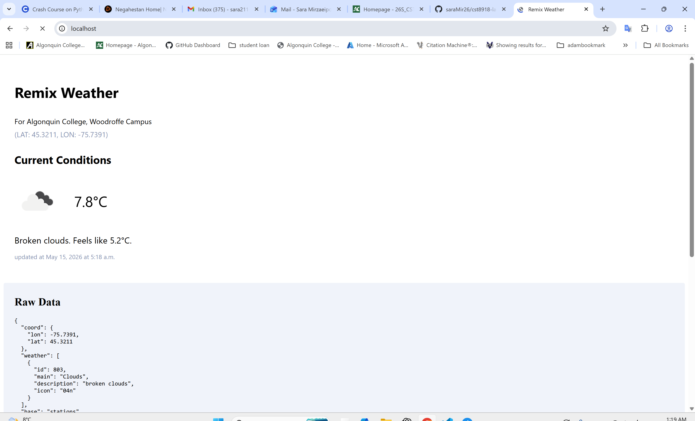
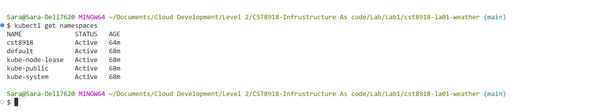
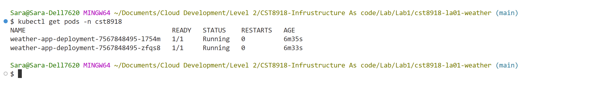
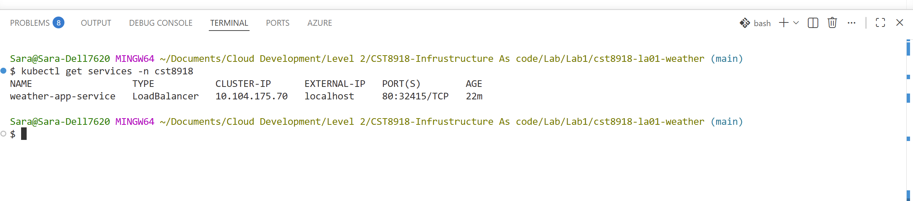

#  CST8918 - Lab A01: Weather App (Kubernetes)

**Name:** Sara Mirzaei
**Course:** CST8918 - DevOps: Infrastructure as Code
**Instructor:** Robert McKenney

---

##  Overview

This lab has built and deployed a weather web application using:

* Node.js (Remix framework)
* Docker (containerization)
* Kubernetes (deployment and orchestration)

The application retrieves weather data using the OpenWeather API and securely stores the API key using Kubernetes Secrets.

---

## Screenshots

**Screenshot 1: Final Application Running via Kubernetes (http://localhost)**
   
  

---

**Screenshot 2: Kubernetes Namespace Created (kubectl get namespaces)**

 

----

**Screenshot 3: Kubernetes Pods Running (kubectl get pods -n cst8918)**

 

---

**Screenshot 4: Kubernetes Services Running (kubectl get services -n cst8918)**

 

---

##  Files Submitted

* All Kubernetes YAML files in the `k8s` folder:

  * `a01_namespace.yaml`
  * `a01_deployment.yaml`
  * `a01_service.yaml`

---
